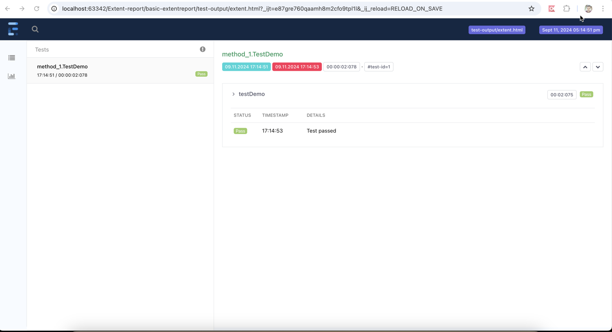

# basic-extentreport
This project includes basic Selenium tests with the Page Object Model (POM) implemented and Extent Reports integrated. It is designed to provide a setup for incorporating Extent Reports into any Selenium automation project.

Release - v1.0 

- ReportBuilder and ExtentManager class - contains required basic methods to instantiate extend report with Test NG report structure 

Sample Report

